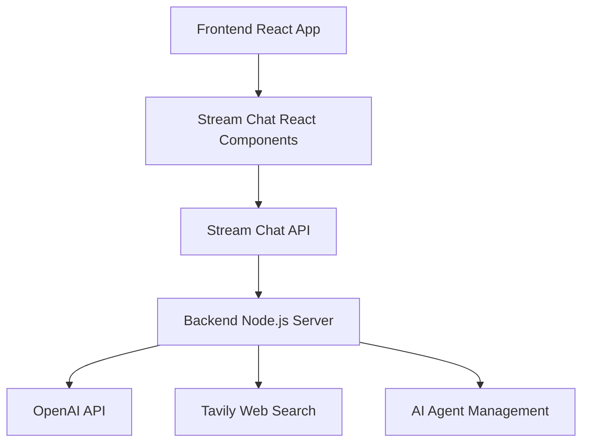

# Chat AI App

A modern AI-powered chat application built with **Stream Chat**, **OpenAI**, and **live web search**. This full‑stack app provides an intelligent writing assistant for content creation, research, and real‑time collaboration.

**Live Demo:** https://ai-chat-assistant-1-sct6.onrender.com/

**Maintainer:** Janki Parmar

---

## Table of Contents

- [Features](#-features)
- [Architecture](#-architecture)
- [Project Structure](#-project-structure)
- [Prerequisites](#-prerequisites)
- [Quick Start (Local)](#-quick-start-local)
- [Environment Variables](#-environment-variables)
- [Running the App](#-running-the-application)
- [Deployment (Render — used in this project)](#-deployment-render--used-in-this-project)
- [How GetStream Works in This App](#-how-getstream-works-in-this-app)
- [AI Agent System](#-ai-agent-system)
- [UI Stack](#-ui-components)
- [API Endpoints](#-api-endpoints)
- [Security](#-security-features)
- [Troubleshooting](#-troubleshooting)
- [Contributing](#-contributing)
- [License](#-license)

---

## 🚀 Features

- **Real‑time Chat:** Powered by GetStream for reliable, low‑latency messaging.
- **AI Writing Assistant:** OpenAI integration for content, summaries, and rewriting.
- **Live Web Search:** Uses Tavily API to fetch current information.
- **Modern UI:** Beautiful React + Tailwind with light/dark mode.
- **Prompt Library:** Ready‑made prompts (business, content, communication, creative).
- **Agent Management:** Create/stop AI agents per channel with auto‑cleanup.
- **JWT Auth:** Secure, short‑lived tokens issued by the backend.
- **Responsive:** Mobile‑first design and accessible components.

---

## 🏗️ Architecture

### Backend (`nodejs-ai-assistant/`)

- **Node.js/Express** server
- **Stream Chat** server‑side auth & channel utilities
- **OpenAI** for AI responses
- **Tavily** for web search
- **Agent lifecycle** with automatic cleanup on inactivity

### Frontend (`react-stream-ai-assistant/`)

- **React + TypeScript**
- **Stream Chat React** components
- **Tailwind CSS + shadcn/ui** for styling
- **Vite** dev/build tooling

---

## 🧭 Project Structure

```
chat-ai-app/
├─ nodejs-ai-assistant/           # Backend (Express, Stream, OpenAI, Tavily)
│  ├─ src/                        # Source code (controllers, routes, services)
│  ├─ package.json
│  ├─ .env.example
│  └─ (tsconfig.json | js files)
│
└─ react-stream-ai-assistant/     # Frontend (React, Vite, Tailwind, Stream Chat)
   ├─ src/
   ├─ index.html
   ├─ package.json
   ├─ .env.example
   └─ vite.config.ts
```

> Folder names above match this README. If your repo differs, keep the env keys and commands the same but adjust the paths.

---

## 📋 Prerequisites

- **Node.js 20+**
- **npm** or **yarn**
- **Accounts/Keys:** GetStream, OpenAI, Tavily

---

## ⚡ Quick Start (Local)

Clone and enter the project root:

```bash
git clone <your-repository-url>
cd chat-ai-app
```

### 1) Backend

```bash
cd nodejs-ai-assistant
cp .env.example .env    # then fill in values
npm install
npm run dev             # or: npm start
```

Default dev server: **http://localhost:3000**

### 2) Frontend

```bash
cd ../react-stream-ai-assistant
cp .env.example .env    # then fill in values
npm install
npm run dev
```

Vite dev server: **http://localhost:8080** (or shown in terminal)

---

## 🔑 Environment Variables

Create `.env` files in both backend and frontend folders.

### Backend (`nodejs-ai-assistant/.env`)

```env
# GetStream (https://getstream.io/dashboard)
STREAM_API_KEY=your_stream_api_key_here
STREAM_API_SECRET=your_stream_api_secret_here

# OpenAI (https://platform.openai.com/api-keys)
OPENAI_API_KEY=your_openai_api_key_here

# Tavily (https://tavily.com)
TAVILY_API_KEY=your_tavily_api_key_here

# Optional
PORT=3000
NODE_ENV=development
CORS_ORIGIN=http://localhost:8080
TOKEN_TTL_SECONDS=3600
```

### Frontend (`react-stream-ai-assistant/.env`)

```env
# Stream Chat public key for the browser
VITE_STREAM_API_KEY=your_stream_api_key_here

# Backend URL
VITE_BACKEND_URL=http://localhost:3000
```

> Ensure **VITE_BACKEND_URL** points to your running backend (local or deployed).

---

## 🚀 Running the Application

### Start the Backend

```bash
cd nodejs-ai-assistant
npm run dev
# or: npm start
```

### Start the Frontend

```bash
cd react-stream-ai-assistant
npm run dev
```

Open your browser to the printed Vite URL (e.g., http://localhost:8080).

---

## ☁️ Deployment (Render — _used in this project_)

Your live app is hosted here: **https://ai-chat-assistant-1-sct6.onrender.com/**

You can deploy **both** backend and frontend on Render as separate services:

### 1) Backend on Render (Web Service)

1. Push your repo to GitHub.
2. In Render, **New > Web Service** → connect your repo.
3. **Root Directory:** `nodejs-ai-assistant`
4. **Environment:** Node
5. **Build Command:**
   - If TypeScript: `npm install && npm run build`
   - If JavaScript only: `npm install`
6. **Start Command:**
   - If TypeScript build: `npm run start`
   - If JavaScript only: `npm start` (or `node server.js`)
7. **Environment Variables:** add
   - `STREAM_API_KEY`
   - `STREAM_API_SECRET`
   - `OPENAI_API_KEY`
   - `TAVILY_API_KEY`
   - `PORT` = `3000` (Render sets `PORT` automatically; your app should use it)
   - `CORS_ORIGIN` = URL of your frontend Render site
8. Deploy. Note the **backend URL** Render gives you.

### 2) Frontend on Render (Static Site)

1. In Render, **New > Static Site** → connect the same repo.
2. **Root Directory:** `react-stream-ai-assistant`
3. **Build Command:** `npm install && npm run build`
4. **Publish Directory:** `dist`
5. **Environment Variables:**
   - `VITE_STREAM_API_KEY` = your Stream API key
   - `VITE_BACKEND_URL`   = the Render backend URL from step 1
6. Deploy. Visit the static site URL (this is your public app).

> **Tip:** If you prefer a single “monolithic” Web Service, you can serve the built frontend from Express. In that case, point Express to the frontend `dist/` directory and deploy only one service.

---

## 📖 How GetStream Works in This App

**Core Concepts**
1. **Client** – the browser SDK handles realtime messaging and presence
2. **Channels** – chat rooms where users send messages
3. **Users** – authenticated entities with Stream-issued JWTs from your backend
4. **Messages** – text, attachments, reactions, threads
5. **Tokens** – short‑lived JWTs signed server‑side

**Integration Flow**



---

## 🤖 AI Agent System

**Lifecycle**
1. **Create** – agent is created per channel when requested
2. **Initialize** – wires OpenAI + web search context
3. **Handle** – processes messages and responds
4. **Search** – Tavily fetches current info when needed
5. **Cleanup** – auto‑disposes after inactivity

**Backend Routes (typical)**
- `POST /start-ai-agent` – start agent for a channel
- `POST /stop-ai-agent`  – stop/cleanup agent
- `GET  /agent-status`   – check agent state
- `POST /token`          – issue Stream JWT for a user

---

## 🎨 UI Components

- **Radix UI** primitives
- **Tailwind CSS** utilities
- **shadcn/ui** components
- **Lucide React** icons
- **Dark/Light** theme support

---

## 📡 API Endpoints

- `GET /` – health check
- `POST /start-ai-agent` – initialize AI agent for a channel
- `POST /stop-ai-agent` – stop and cleanup AI agent
- `GET /agent-status` – current status
- `POST /token` – generate user auth token for Stream Chat

> Exact request/response shapes may vary depending on your implementation, but the route purposes match the above.

---

## 🔒 Security Features

- **JWT Auth** – short‑lived tokens from the backend
- **CORS** – restrict to your frontend domain
- **Secrets in .env** – never commit keys
- **Input Validation** – validate all server inputs
- **Token Expiry/Refresh** – avoid long‑lived tokens in the browser

---

## 🛠️ Troubleshooting

- **CORS errors:** Ensure `CORS_ORIGIN` (backend) matches your deployed frontend URL.
- **Unauthorized with Stream:** Make sure the frontend uses tokens issued by your backend; do not embed a secret in the browser.
- **OpenAI/Tavily failures:** Double‑check keys and usage limits in the respective dashboards.
- **Frontend can’t reach backend:** Confirm `VITE_BACKEND_URL` is the public backend URL.
- **Render build loops:** Clear cache, verify build command and Node version.

---

## 🤝 Contributing

1. Fork this repo
2. Create a feature branch
3. Make changes
4. Add tests if applicable
5. Open a PR

---

## 📄 License

This project is licensed under the **MIT License**. See [LICENSE](./LICENSE) for details.

© 2025 Janki Parmar
